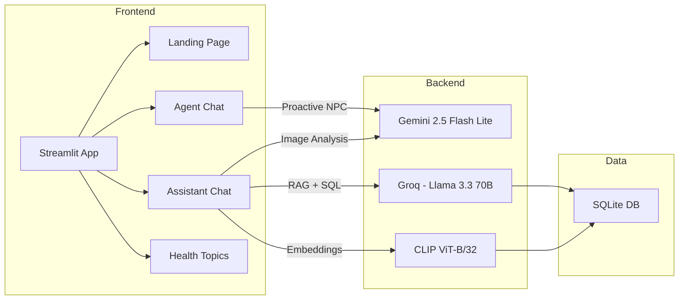

# IliaChan TechWell — Walkthrough

## Overview

**IliaChan TechWell** adalah platform web edukasi kesehatan digital berbasis chatbot AI, dibangun menggunakan Python + Streamlit + Ngrok. Aplikasi ini menampilkan karakter NPC **"Iliachan"** — entitas bio-organik dari abad ke-30 — yang mengedukasi pekerja digital tentang dampak kebiasaan teknologi terhadap kesehatan.

## Architecture



## Pages & Screenshots

### Landing Page
Dark themed hero with particle animation, stats bar, and 3 navigation cards.

![Landing Page]


### Agent Chat — Iliachan NPC
Proactive AI character that greets users, asks about health habits, and steers conversation toward digital health topics. Powered by **Gemini 2.5 Flash Lite**.

![Agent Chat]


### Health Topics Library
Gallery of 8 health topics with category filters, risk levels, and detail views with journal references.

![Health Topics]


### Assistant Chat — Health Consultation
Reactive AI assistant with photo upload, RAG-powered responses, and SQL database queries. Powered by **Groq (Llama 3.3 70B)** + **Gemini Vision**.

![Assistant Chat]


### Demo Recording


---

## Files Created (20 files)

### Core
| File | Purpose |
|------|---------|
| [app.py](file:///c:/Users/febry/Downloads/Folder%20Baru/IliaChanTechWell/app.py) | Main landing page with animations |
| [config.py](file:///c:/Users/febry/Downloads/Folder%20Baru/IliaChanTechWell/config.py) | API keys, paths, client factories |
| [requirements.txt](file:///c:/Users/febry/Downloads/Folder%20Baru/IliaChanTechWell/requirements.txt) | Python dependencies |
| [.env](file:///c:/Users/febry/Downloads/Folder%20Baru/IliaChanTechWell/.env) | API keys (Gemini, Groq, Ngrok) |
| [setup_and_run.py](file:///c:/Users/febry/Downloads/Folder%20Baru/IliaChanTechWell/setup_and_run.py) | Auto-setup + Ngrok tunnel launcher |

### Database
| File | Purpose |
|------|---------|
| [database/init_db.py](file:///c:/Users/febry/Downloads/Folder%20Baru/IliaChanTechWell/database/init_db.py) | Schema creation + seed data |
| [database/seed_data.py](file:///c:/Users/febry/Downloads/Folder%20Baru/IliaChanTechWell/database/seed_data.py) | 8 topics, 14 journals, 19 recommendations |

### Chatbot
| File | Purpose |
|------|---------|
| [chatbot/prompts.py](file:///c:/Users/febry/Downloads/Folder%20Baru/IliaChanTechWell/chatbot/prompts.py) | System prompts for Agent & Assistant |
| [chatbot/agent.py](file:///c:/Users/febry/Downloads/Folder%20Baru/IliaChanTechWell/chatbot/agent.py) | Proactive Iliachan NPC (Gemini) |
| [chatbot/assistant.py](file:///c:/Users/febry/Downloads/Folder%20Baru/IliaChanTechWell/chatbot/assistant.py) | Reactive health assistant (Groq + Gemini Vision) |

### RAG Pipeline
| File | Purpose |
|------|---------|
| [rag/clip_engine.py](file:///c:/Users/febry/Downloads/Folder%20Baru/IliaChanTechWell/rag/clip_engine.py) | CLIP embedding generation |
| [rag/retrieval.py](file:///c:/Users/febry/Downloads/Folder%20Baru/IliaChanTechWell/rag/retrieval.py) | Vector similarity + keyword search |
| [rag/processor.py](file:///c:/Users/febry/Downloads/Folder%20Baru/IliaChanTechWell/rag/processor.py) | RAG context builder + Groq response |

### UI Components
| File | Purpose |
|------|---------|
| [components/animations.py](file:///c:/Users/febry/Downloads/Folder%20Baru/IliaChanTechWell/components/animations.py) | Particle bg, typing effect, glow cards |
| [components/chat_ui.py](file:///c:/Users/febry/Downloads/Folder%20Baru/IliaChanTechWell/components/chat_ui.py) | Custom chat bubbles + header |
| [components/sidebar.py](file:///c:/Users/febry/Downloads/Folder%20Baru/IliaChanTechWell/components/sidebar.py) | Sidebar with tips + stats |
| [components/health_cards.py](file:///c:/Users/febry/Downloads/Folder%20Baru/IliaChanTechWell/components/health_cards.py) | Topic cards + detail view |

### Pages
| File | Purpose |
|------|---------|
| [pages/1_Agent_Chat.py](file:///c:/Users/febry/Downloads/Folder%20Baru/IliaChanTechWell/pages/1_Agent_Chat.py) | Agent chat page |
| [pages/2_Assistant_Chat.py](file:///c:/Users/febry/Downloads/Folder%20Baru/IliaChanTechWell/pages/2_Assistant_Chat.py) | Assistant consultation page |
| [pages/3_Health_Topics.py](file:///c:/Users/febry/Downloads/Folder%20Baru/IliaChanTechWell/pages/3_Health_Topics.py) | Health topics gallery |

---

## Database Content
- **8 Health Topics**: Duduk lama, postur bungkuk, rebahan+HP, gadget gelap, HP sebelum tidur, makan di ranjang, eye strain, earphone
- **14 Journal References**: From PubMed, WHO, OSHA, AAO
- **19 Recommendations**: With difficulty levels and equipment needed
- **6 AI-Generated Images**: Educational infographics for topics 1-6

---

## How to Run

### Changes (Key,Token)
```bash
GEMINI_API_KEY=your_gemini_api_key_here
NGROK_AUTH_TOKEN=your_ngrok_auth_token_here
GROG_API_KEY=your_grog_api_key_here
```

### Quick Start (Local)
```bash
cd "c:\Users\febry\Downloads\Folder Baru\IliaChanTechWell"
python -m streamlit run app.py --theme.base dark
```

### With Ngrok Tunnel (Public URL)
```bash
cd "c:\Users\febry\Downloads\Folder Baru\IliaChanTechWell"
python setup_and_run.py
```
### Run Deploy (Public URL)
```bash
cd c:\Users\febry\Downloads\Folder Baru\IliaChanTechWell
pip install -r requirements.txt
python database/init_db.py
streamlit run app.py
```

### Currently Running
- **Local URL**: http://localhost:8501
- **Network URL**: http://192.168.18.10:8501

---

## Validation Results
- ✅ All dependencies installed successfully
- ✅ Database initialized (8 topics, 14 journals, 19 recs)
- ✅ Landing page renders with animations
- ✅ Agent Chat: Iliachan greets proactively via Gemini
- ✅ Assistant Chat: Upload + chat interface ready
- ✅ Health Topics: Gallery with filter + detail views
- ✅ Dark theme + glassmorphism styling applied
- ✅ Sidebar with rotating health tips working
